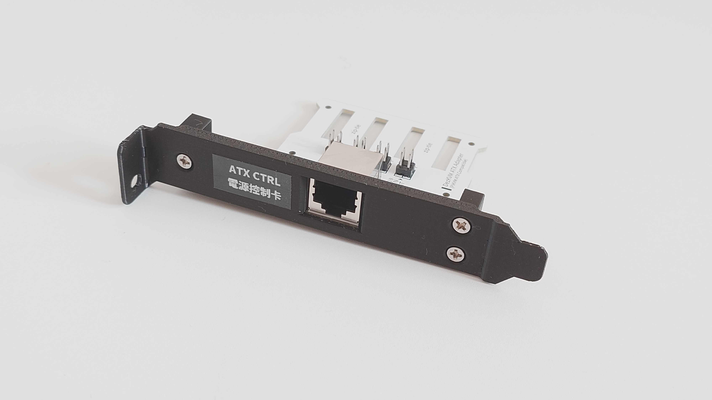
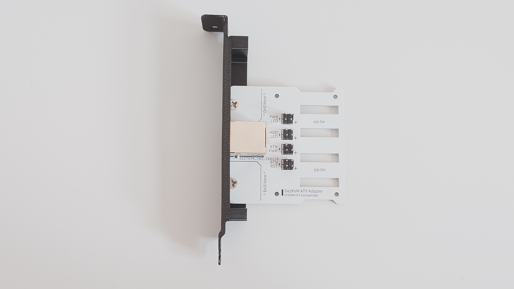
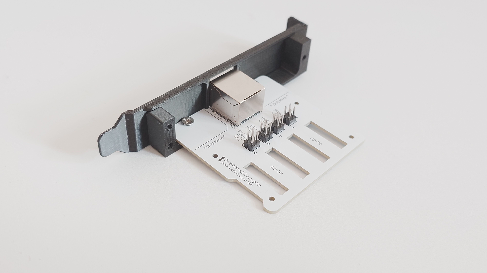
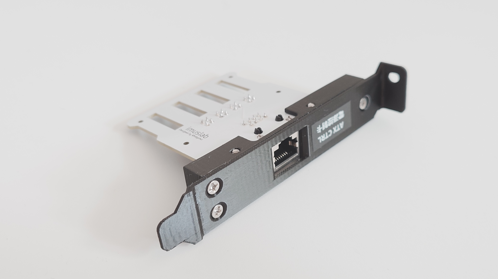

# DezKVM ATX board

The DezKVM ATX board has the same pin layout as PiKVM ATX board but in a more refined package.

## Parts

- ATX board PCB
- RJ45 conector (18.3mm)
- 4 x 2x2p 2.54 male header
- 3D printed parts 
- 5 x M3x5mm screws
- Dupont Wires of required lengths (depends on your PC case and motherboard layout)
  - 8 x Male to Female (Front-panel to ATX board) 
  - 8 x Female to Female (ATX board to motherboard front-panel headers)
- (Optional) atx-adapter_cable-press.stl model if zip-tie looks bad on your setup

## Photos

