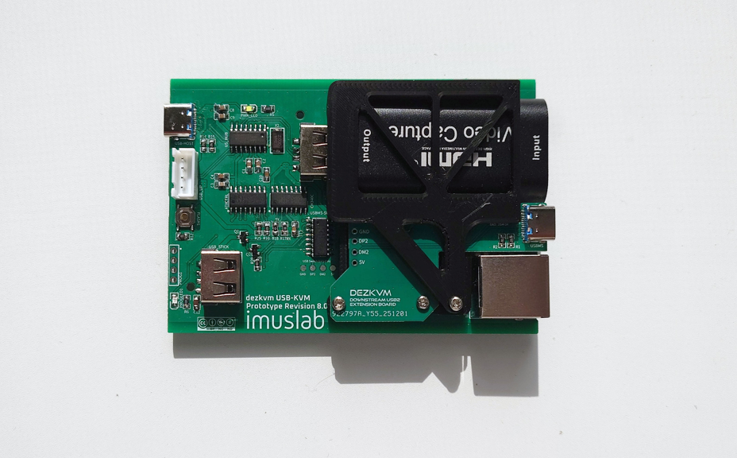
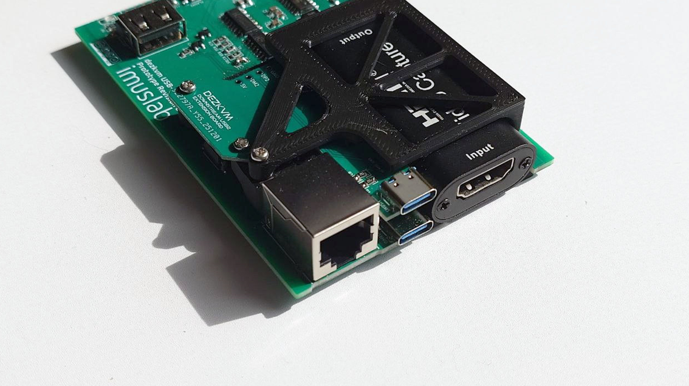
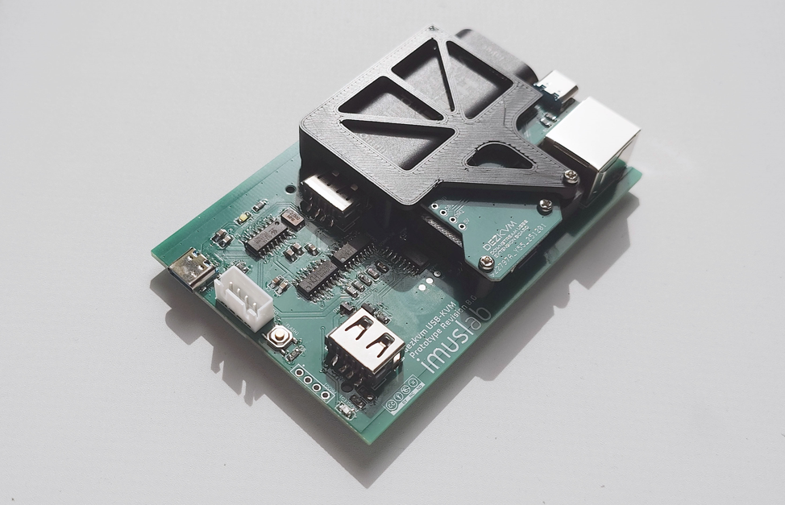
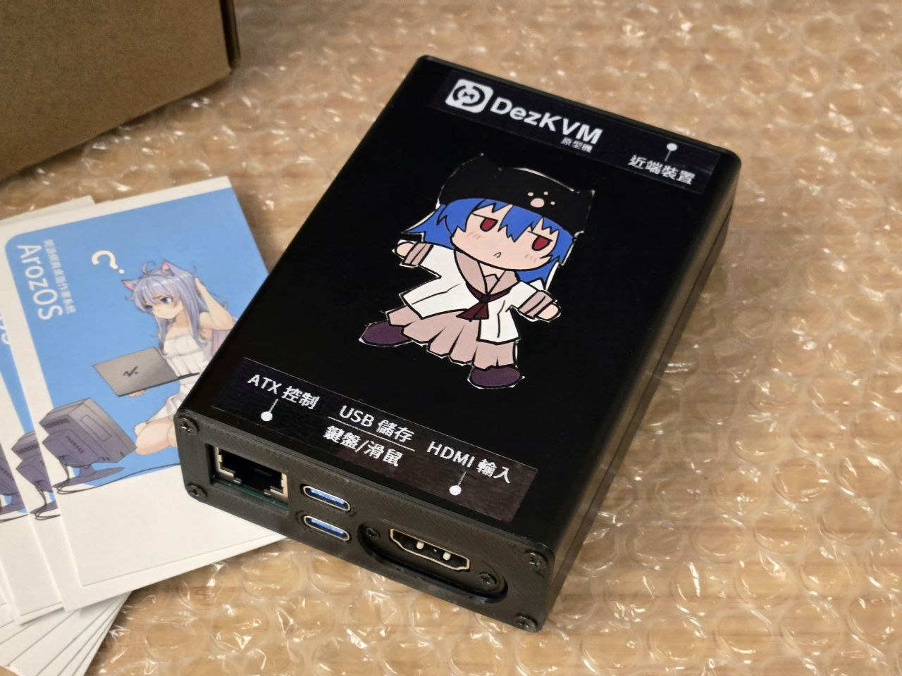
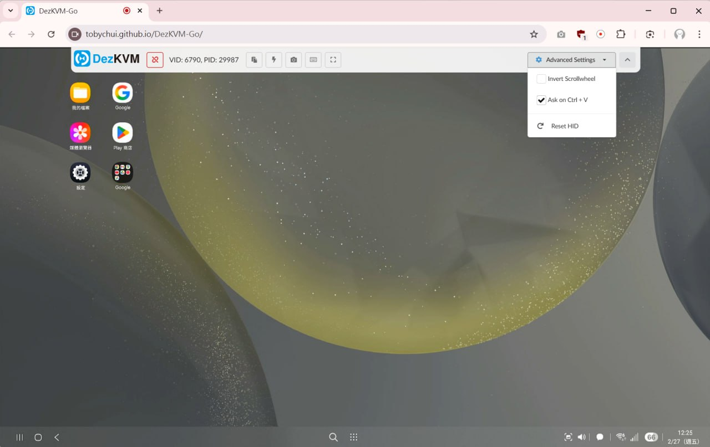

# DezKVM PoC (Prototype Versions)

The prototype version creates only the USB-KVM part of the whole IP-KVM.

The finalized prototype version stops at v8, with completed USB host / remote swap, KVM, HDMI capture and on board AUX MCU for handling status checking and ATX controls.

There are 4 ports exposed on the remote side

- HDMI input port
- RJ45 ATX control port
- Two USB type-C port
  - Upper one: USB mass storage switch over (the internal USB port)
  - Lower one: USB HID (keyboard and mouse emulation)

On the host side, there are two ports

- USB type C (USB 2.0)
  - Also expose as XH2.54 1*4p (USB 2.0 pins, the white connector)
- USB 2.0 PROG pins (unpopulataed in the photo below, for programming the onboard E8051 MCU)

## Using as a USB-KVM device

After installing the PCB into a proper case, you can also use it as a dedicated USB over KVM device. 

For the control interface and usage instructions, see [DezKVM Go](https://github.com/tobychui/DezKVM-Go)  (which is a spin-off of this project)

