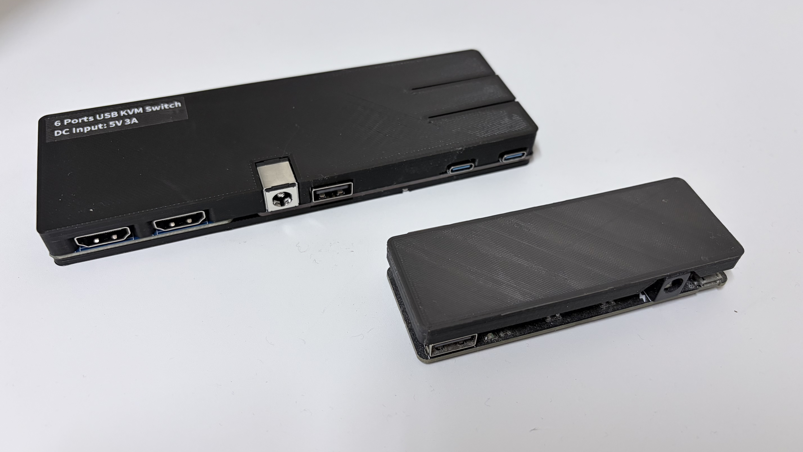
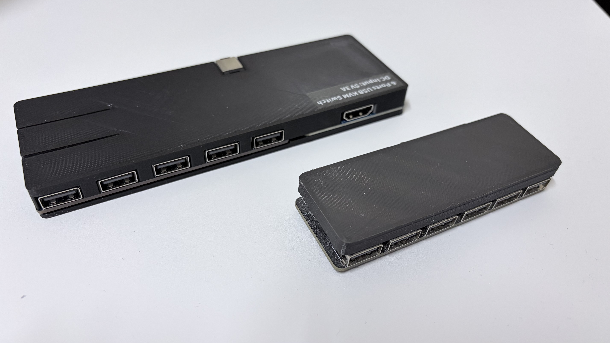
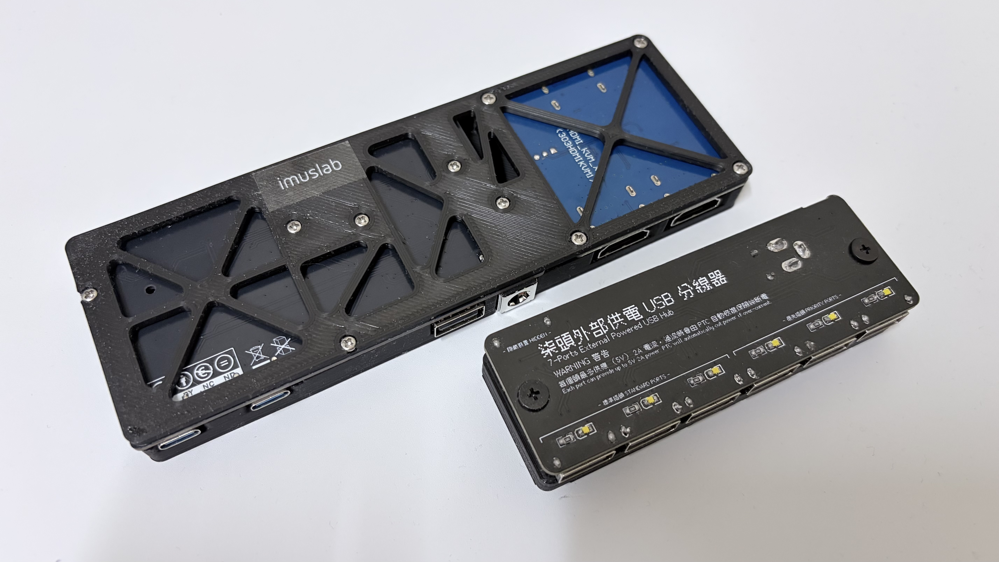
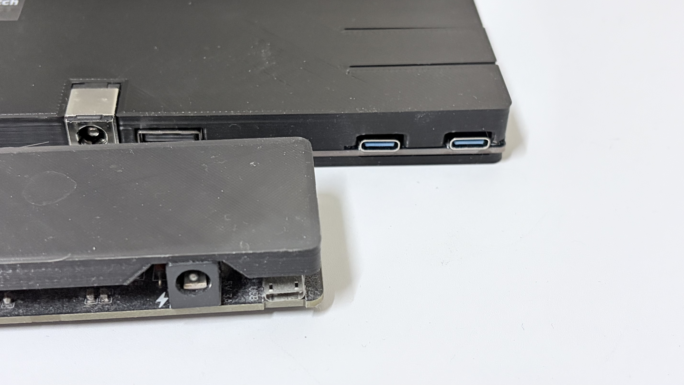
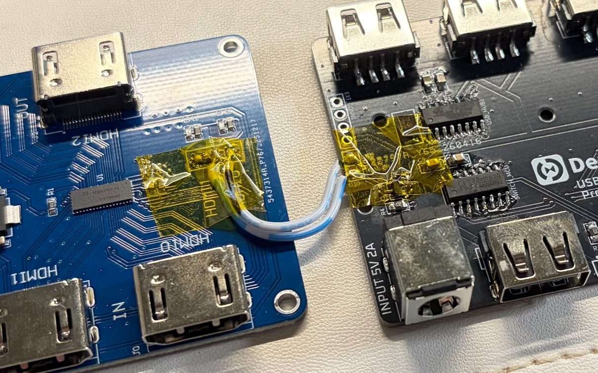
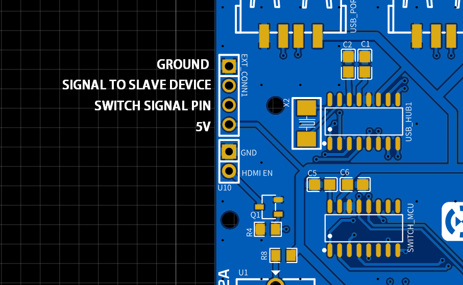
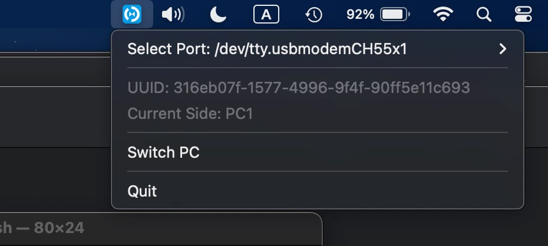

# Software Controlled USB KVM Switch

A DIY USB KVM (Keyboard, Video, Mouse) switch designed for homelab environments. This project includes firmware, a cross-platform control application, PCB design, and 3D models for the enclosure. 

It works with DezKVM (or any kind of IP-KVM as soon as both hosts, PC1 and PC2 that you are remote connecting got a desktop interface or serial interface driver that support USB ACM serial devices) for switching USB (and additional connections, see State Synchronize MOSFET section below) between two hosts.


## Overview

This is a complete hardware and software solution for switching USB keyboard, video, and mouse between multiple computers using a simple USB device with a companion control application.

## Photos

Here are some photos of the USB KVM Switch device (large one) together with my previous DIY 7 ports USB hub (small one)










## Synchronize Switching with Other Connectors/ Devices

### State Synchronize MOSFET 

There is an onboard MOSFET that pull up / down with the host switch status. You can use that electrical signal to control other devices or modules. For example, this is an off-the-shelf HDMI switch module that has been modified to use with the USB KVM switch. The original 2 way toggle switch has been replaced by a 1k Ohm resistor (to keep the signal pin pull high) and the pull ground behavior is triggered by the onboard N channel MOSFET (AO3400)




### Slave Device IO

There are an additional 4 2.54*4 pins at the edge of the board for linking another devices with MCU if needed. So switch states can be synchronized between two KVM switches.




The IO definitions are as followings.

- Electrical Ground
- Signal to slave devices, depending on the firmware, set to HIGH or LOW when the current KVM is set to HOST1 / HOST2
- Switch signal pins, electrically connected to the switch button on the right side of the board, active high (default pull low)
- 5V from DC jack or USB type C, depending on if R8 is populated

## Directory Structure

```
├── apps/                 # Go-based control application
│   ├── main.go
│   ├── port_darwin.go    # macOS serial port support
│   ├── ports_linux.go    # Linux serial port support
│   ├── ports_windows.go  # Windows serial port support
│   ├── settings.json     # Application settings
│   ├── build_*.sh/*.bat  # Build scripts for different platforms
│   └── internal/
│       ├── kvmswitch/    # Core KVM switch logic
│       └── icon/         # Systray icon resources
├── firmware/             # Arduino firmware
│   └── kvm_switch/
│       ├── kvm_switch.ino      # Main firmware
│       └── uuid_service.ino    # UUID management
├── hardware/             # PCB design and manufacturing files
│   ├── rev1/             # Revision 1 (initial release)
│   └── rev2/             # Revision 2 (current)
├── 3D models/            # Enclosure design
└── docs/
```

## Features

- **Cross-Platform**: Runs on Windows and macOS
- **Systray Integration**: Minimize to system tray for easy access
  
- **Auto-Detection**: Automatically detects connected USB KVM switches
- **Settings Persistence**: Remembers last connected port
- **Serial Communication**: Direct control via USB serial interface

## Building

### Desktop App

#### Prerequisites

- Go 1.25.0 or later

#### Build Commands

```bash
cd ./apps
go mod tidy
go build //development build only
```

For production build (no cmd popup windows)

- **macOS**: `bash apps/build_mac.sh`
- **Windows**: `apps/build_win.bat`

### Firmware

The Arduino firmware is located in `firmware/kvm_switch/kvm_switch.ino` and can be uploaded using the Arduino IDE with CH55xduino board definitions.

### Hardware

PCB files and manufacturing data are in `hardware/` directory:
- **BOM**: Bill of Materials (CSV)
- **PCB**: PCB layout files (JSON)
- **Schematic**: Circuit schematic (JSON)
- **Pick & Place**: Component placement data (CSV)

### 3D Models

Enclosure models are designed using Autodesk Inventor:
- `cover.ipt` - Top cover
- `bottom.ipt` - Bottom enclosure
- `*_no-hdmi.*` - Variants without HDMI switch, just the USB KVM part

## Controlling with Serial

You can also optionally control it directly with serial applications like putty or Arduino IDE Serial Monitor. The commands are as follows (single character ascii at 115200 baud rate).

```
0 - Switch KVM to Host 1
1 - Switch KVM to Host 2
? - Return the current KVM switch side
u - Return the UUID in DezKVM LTV data structure
```


## IMPORTANT NOTES

**When you switch the KVM from Host 1 to Host 2, the control MCU get switched as well.**

**So if you are switching from Host 1 to Host 2 but Host 2 doesn't connects to anything, you will need to manually press the switch button to switch it back to Host 1.**

**That means you need to make sure both hosts are online before switching OR you are physically present in front of the switch / computer for switching. DO NOT USE THIS IN FULL REMOTE IP-KVM USE CASE WHEN YOU HAVE NO EASY PHYSICAL ACCESS TO THE SWITCH** 

## License

Software: AGPL

Hardware: CC BY-NC-ND
